# Model Architectures Documentation

This document provides a comprehensive overview of all neural network architectures implemented in the `models` directory for time-series classification tasks.

---

## Table of Contents

1. [DSICNN - Dilated Separable Inverted Convolution Neural Network](#1-dsicnn)
2. [ResNet1D - 1D Residual Network](#2-resnet1d)
3. [DenseNet1D - 1D Dense Network](#3-densenet1d)
4. [EfficientNet1D - 1D EfficientNet](#4-efficientnet1d)
5. [WRN1D - Wide Residual Network 1D](#5-wrn1d)
6. [CNN_BiLSTM - CNN with Bidirectional LSTM](#6-cnn_bilstm)
7. [CNN_SelfAttention - CNN with Self-Attention](#7-cnn_selfattention)
8. [DPCCNN - Dilated Pointwise CNN with SE and GAB](#8-dpccnn)
9. [ResNetClassifier - 2D ResNet with STFT](#9-resnetclassifier)
10. [TransformerEncoderClassifier - Transformer for Time-Series](#10-transformerencoderclassifier)
11. [Supporting Modules](#11-supporting-modules)

---

## Architecture Taxonomy

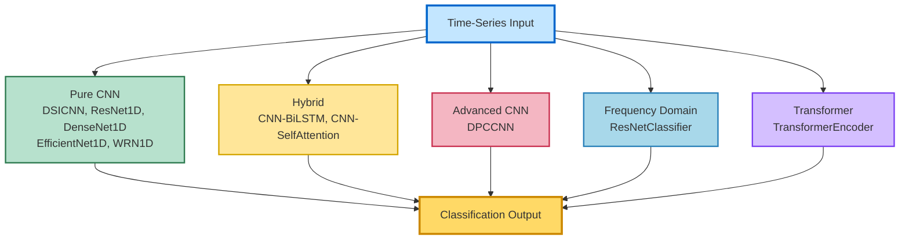

## Key Building Blocks

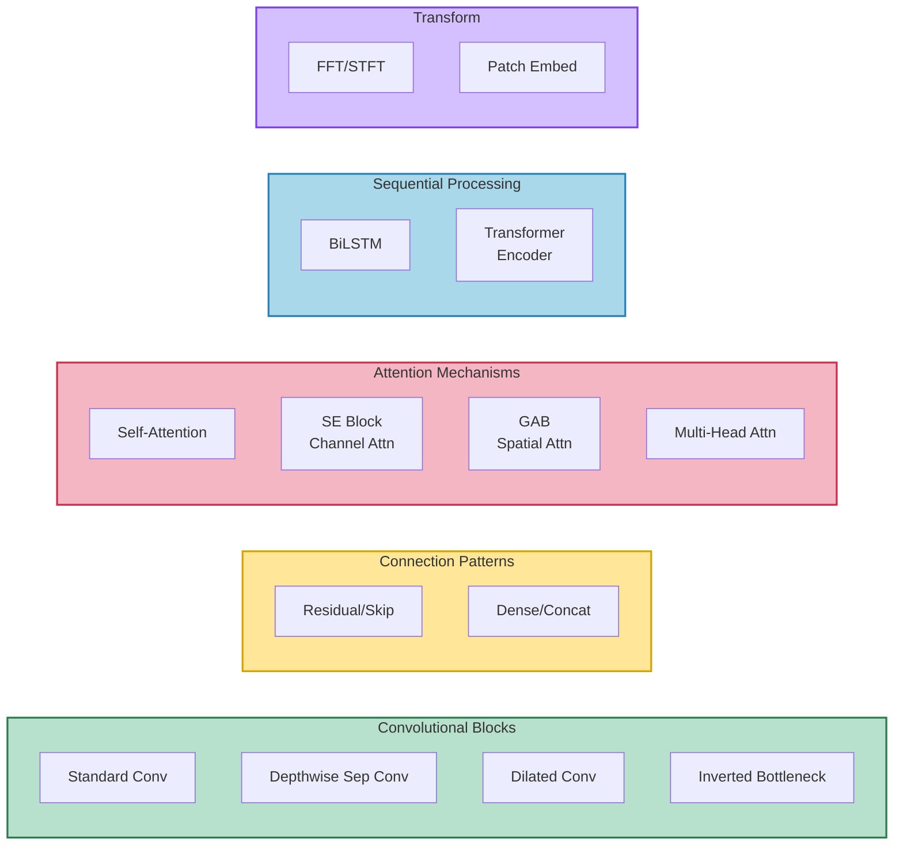

---

## 1. DSICNN

**File:** `DSICNN.py`

### Architecture Design

DSICNN (Dilated Separable Inverted Convolution Neural Network) is a lightweight CNN architecture that uses depthwise separable convolutions with dilation for efficient feature extraction from 1D time-series data.

### Architecture Components

#### DCIM Module (Dilated Convolution Inverted Module)
- **Depthwise Convolution**: Kernel size 3 with dilation
- **Pointwise Convolution**: 1×1 convolution for channel mixing
- **Batch Normalization**: Applied after both depthwise and pointwise operations
- **Global Average Pooling**: Adaptive pooling to single value per channel

#### Main Network Structure
1. **Conv Layer 1**: 1→16 channels, kernel=64
2. **BatchNorm + ReLU + MaxPool**: Pool size=4
3. **Conv Layer 2**: 16→64 channels, kernel=3
4. **BatchNorm + ReLU + MaxPool**: Pool size=4
5. **DCIM Block**: 64→64 channels, dilation_rate=9
6. **Fully Connected**: 64→num_classes

### Hyperparameters

| Parameter | Value | Description |
|-----------|-------|-------------|
| `num_classes` | Configurable | Number of output classes |
| `conv1_channels` | 16 | First conv layer output channels |
| `conv1_kernel` | 64 | First conv layer kernel size |
| `conv2_channels` | 64 | Second conv layer output channels |
| `conv2_kernel` | 3 | Second conv layer kernel size |
| `pool_size` | 4 | MaxPool kernel size |
| `dilation_rate` | 9 | Dilation rate for DCIM |

### Input/Output
- **Input**: `(batch_size, sequence_length)` - 1D signal
- **Output**: `(batch_size, num_classes)` - Class logits

### Architecture Diagram

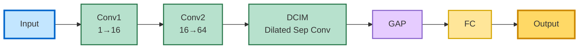

---

## 2. ResNet1D

**File:** `Resnet1D.py`

### Architecture Design

A 1D adaptation of the classic ResNet architecture, featuring residual blocks with skip connections to enable training of deeper networks while avoiding vanishing gradient problems.

### Architecture Components

#### ResidualBlock
- **Conv1**: 3×1 convolution with stride
- **BatchNorm1 + ReLU + Dropout**
- **Conv2**: 3×1 convolution
- **BatchNorm2**
- **Residual Connection**: Identity or downsampled skip connection
- **Final ReLU activation**

#### Main Network Structure
1. **Initial Conv**: 1→16 channels, kernel=7, stride=2
2. **BatchNorm + ReLU + MaxPool**: Kernel=3, stride=2
3. **Layer 1**: N×ResidualBlock (16 channels)
4. **Layer 2**: N×ResidualBlock (32 channels, stride=2)
5. **Layer 3**: N×ResidualBlock (64 channels, stride=2)
6. **Global Average Pooling**
7. **Feature Extractor**: Linear(64→64) + ReLU + Dropout
8. **Classifier**: Linear(64→num_classes)

### Hyperparameters

| Parameter | Value | Description |
|-----------|-------|-------------|
| `num_classes` | 10 (default) | Number of output classes |
| `layers` | [N, N, N] | Number of blocks per layer |
| `dropout_rate` | 0.3 | Dropout probability in final layers |
| `block_dropout` | 0.2 | Dropout within residual blocks |
| `init_channels` | 16 | Initial number of channels |
| `init_kernel` | 7 | Initial convolution kernel size |
| `init_stride` | 2 | Initial convolution stride |

### Weight Initialization
- **Conv layers**: Kaiming normal initialization (fan_out, ReLU)
- **BatchNorm**: Weights=1, Bias=0

### Input/Output
- **Input**: `(batch_size, 1, sequence_length)` - Single channel 1D signal
- **Output**: `(batch_size, num_classes)` - Class logits

### Architecture Diagram

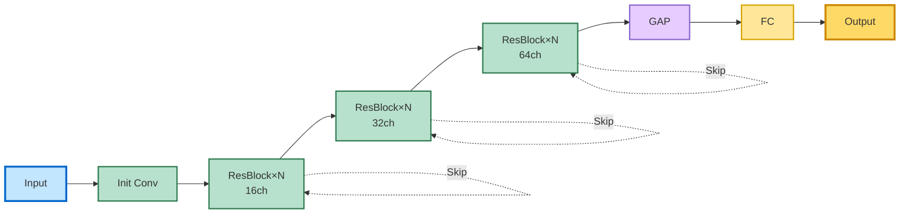

---

## 3. DenseNet1D

**File:** `Densnet.py`

### Architecture Design

1D adaptation of DenseNet featuring dense connections where each layer receives feature maps from all preceding layers, promoting feature reuse and gradient flow.

### Architecture Components

#### DenseBlock
- **Multiple Conv Layers**: Each produces `growth_rate` feature maps
- **Dense Connections**: Each layer concatenates all previous outputs
- **Layer Structure**: Conv1d(kernel=3) + BatchNorm + ReLU

#### TransitionLayer
- **Purpose**: Reduces spatial dimensions and channels between dense blocks
- **Structure**: 
  - Conv1d(kernel=1) - Channel reduction
  - BatchNorm + ReLU
  - AvgPool1d(kernel=2, stride=2)

#### Main Network Structure
1. **Initial Conv**: 1→16 channels, kernel=7, stride=2
2. **BatchNorm + ReLU + MaxPool**: Kernel=3, stride=2
3. **DenseBlock 1** + **Transition 1** (reduces channels by 50%)
4. **DenseBlock 2** + **Transition 2** (reduces channels by 50%)
5. **DenseBlock 3**
6. **Global Average Pooling**
7. **Fully Connected**: →num_classes

### Hyperparameters

| Parameter | Value | Description |
|-----------|-------|-------------|
| `num_classes` | 10 (default) | Number of output classes |
| `growth_rate` | 16 | Feature maps added per layer |
| `num_layers` | [4, 4, 4] | Layers per dense block |
| `init_channels` | 16 | Initial convolution output channels |
| `init_kernel` | 7 | Initial convolution kernel size |
| `init_stride` | 2 | Initial convolution stride |
| `transition_reduction` | 0.5 | Channel reduction factor (50%) |

### Channel Growth Pattern
- **After Init**: 16 channels
- **After DenseBlock1**: 16 + (4 × 16) = 80 → Transition → 40
- **After DenseBlock2**: 40 + (4 × 16) = 104 → Transition → 52
- **After DenseBlock3**: 52 + (4 × 16) = 116

### Input/Output
- **Input**: `(batch_size, 1, sequence_length)` - Single channel 1D signal
- **Output**: `(batch_size, num_classes)` - Class logits

### Architecture Diagram

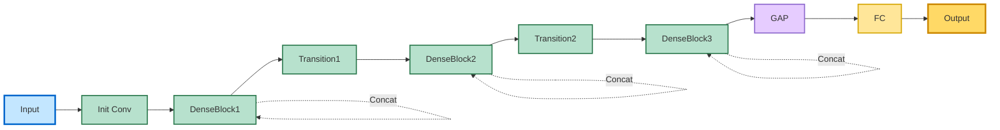

---

## 4. EfficientNet1D

**File:** `EfficientNet.py`

### Architecture Design

1D adaptation of EfficientNet using Mobile Inverted Bottleneck Convolution (MBConv) blocks, which are efficient building blocks that use expansion, depthwise convolution, and projection.

### Architecture Components

#### MBConv1D Block
- **Expansion**: 1×1 Conv to expand channels (factor=6)
- **Depthwise Conv**: 3×1 depthwise convolution (groups=hidden_dim)
- **Projection**: 1×1 Conv to project back to output channels
- **Skip Connection**: When input_channels == output_channels and stride=1

#### Main Network Structure
1. **Initial Conv**: 1→32 channels, kernel=3, stride=2
2. **BatchNorm + ReLU**
3. **MBConv1**: 32→64 channels, expansion=6, stride=2
4. **MBConv2**: 64→128 channels, expansion=6, stride=2
5. **MBConv3**: 128→256 channels, expansion=6, stride=2
6. **Global Average Pooling**
7. **Fully Connected**: 256→num_classes

### Hyperparameters

| Parameter | Value | Description |
|-----------|-------|-------------|
| `num_classes` | 10 (default) | Number of output classes |
| `expansion` | 6 | Channel expansion factor in MBConv |
| `init_channels` | 32 | Initial convolution output channels |
| `mbconv1_out` | 64 | MBConv1 output channels |
| `mbconv2_out` | 128 | MBConv2 output channels |
| `mbconv3_out` | 256 | MBConv3 output channels |

### Channel Progression
- **Initial**: 1 → 32
- **MBConv1**: 32 → (32×6=192) → 64
- **MBConv2**: 64 → (64×6=384) → 128
- **MBConv3**: 128 → (128×6=768) → 256

### Input/Output
- **Input**: `(batch_size, 1, sequence_length)` - Single channel 1D signal
- **Output**: `(batch_size, num_classes)` - Class logits

### Architecture Diagram

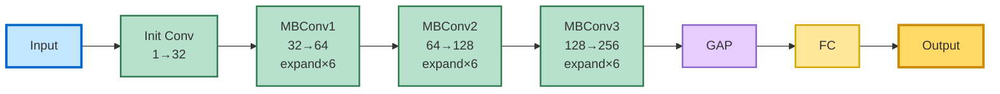

---

## 5. WRN1D

**File:** `WideResidualnet.py`

### Architecture Design

Wide Residual Network for 1D signals. WRN increases network width (channels) rather than depth, using a widening factor to create wider but shallower networks compared to standard ResNets.

### Architecture Components

#### WideResidualBlock
- **Conv1**: 3×1 Conv, expanded to `out_channels * widen_factor`
- **BatchNorm1 + ReLU + Dropout**
- **Conv2**: 3×1 Conv, back to `out_channels`
- **BatchNorm2**
- **Skip Connection**: Direct or downsampled (1×1 Conv)
- **Final ReLU**

#### Main Network Structure
1. **Initial Conv**: 1→16 channels, kernel=7, stride=2
2. **BatchNorm + ReLU + MaxPool**: Kernel=3, stride=2
3. **Layer 1**: N×WideResidualBlock (16 channels)
4. **Layer 2**: N×WideResidualBlock (32 channels, stride=2)
5. **Layer 3**: N×WideResidualBlock (64 channels, stride=2)
6. **Global Average Pooling**
7. **Fully Connected**: 64→num_classes

### Hyperparameters

| Parameter | Value | Description |
|-----------|-------|-------------|
| `num_classes` | 10 (default) | Number of output classes |
| `widen_factor` | 2 | Width multiplier for convolutions |
| `depth` | 22 | Total network depth |
| `dropout_rate` | 0.2 | Dropout probability |
| `blocks_per_layer` | depth // 6 | Number of blocks per layer |
| `init_channels` | 16 | Initial number of channels |

### Width Pattern (widen_factor=2)
- **Layer 1**: 16 → (16×2=32) → 16
- **Layer 2**: 32 → (32×2=64) → 32
- **Layer 3**: 64 → (64×2=128) → 64

### Input/Output
- **Input**: `(batch_size, 1, sequence_length)` - Single channel 1D signal
- **Output**: `(batch_size, num_classes)` - Class logits

### Architecture Diagram

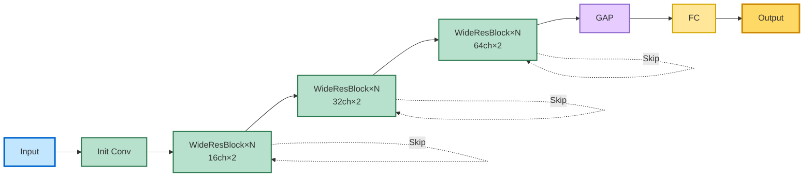

---

## 6. CNN_BiLSTM

**File:** `CNN_BiLSTM.py`

### Architecture Design

Hybrid architecture combining CNN layers for local feature extraction with Bidirectional LSTM for capturing temporal dependencies in both forward and backward directions.

### Architecture Components

#### CNN Frontend
1. **Conv1**: 1→32 channels, kernel=7, stride=2
2. **BatchNorm1 + ReLU + MaxPool**: Kernel=3, stride=2
3. **Conv2**: 32→64 channels, kernel=5, stride=2
4. **BatchNorm2 + ReLU + MaxPool**: Kernel=3, stride=2
5. **Conv3**: 64→128 channels, kernel=3
6. **BatchNorm3 + ReLU + MaxPool**: Kernel=3, stride=2

#### BiLSTM Backend
- **Input Size**: 128 (from CNN output)
- **Hidden Size**: Configurable (default=128)
- **Num Layers**: Configurable (default=2)
- **Bidirectional**: True (outputs 2×hidden_size)
- **Batch First**: True

#### Classifier
- **Global Average Pooling**: Over sequence dimension
- **Fully Connected**: (hidden_size×2)→num_classes

### Hyperparameters

| Parameter | Value | Description |
|-----------|-------|-------------|
| `input_channels` | 1 | Input signal channels |
| `num_classes` | 10 (default) | Number of output classes |
| `hidden_size` | 128 | LSTM hidden state size |
| `lstm_layers` | 2 | Number of LSTM layers |
| `conv1_out` | 32 | First conv output channels |
| `conv2_out` | 64 | Second conv output channels |
| `conv3_out` | 128 | Third conv output channels |

### Data Flow
1. **Input**: `(batch, 1, seq_len)`
2. **After CNN**: `(batch, 128, reduced_seq_len)`
3. **Transpose**: `(batch, reduced_seq_len, 128)`
4. **After BiLSTM**: `(batch, reduced_seq_len, 256)`
5. **After Mean Pooling**: `(batch, 256)`
6. **Output**: `(batch, num_classes)`

### Input/Output
- **Input**: `(batch_size, 1, sequence_length)` - Single channel 1D signal
- **Output**: `(batch_size, num_classes)` - Class logits

### Architecture Diagram

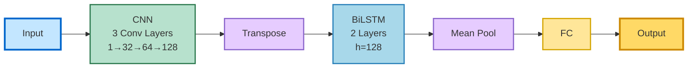

---

## 7. CNN_SelfAttention

**File:** `CNN_selfattention.py`

### Architecture Design

Combines convolutional layers with self-attention mechanism to capture both local patterns (via CNN) and global dependencies (via attention).

### Architecture Components

#### SelfAttention Module
- **Query**: Conv1d, channels→channels/8, kernel=1
- **Key**: Conv1d, channels→channels/8, kernel=1
- **Value**: Conv1d, channels→channels, kernel=1
- **Scaling**: Attention scores scaled by √(channels/8)
- **Learnable γ**: Parameter controlling attention contribution
- **Formula**: `output = γ * attention(V) + x`

#### CNN Architecture
1. **Conv1**: 1→32 channels, kernel=16, padding=8
2. **BatchNorm1 + ReLU + MaxPool**: Kernel=4
3. **Conv2**: 32→64 channels, kernel=8, padding=4
4. **BatchNorm2 + ReLU + MaxPool**: Kernel=4
5. **Self-Attention Layer**: 64→64 channels
6. **Flatten**
7. **FC1**: →256 + ReLU + Dropout(0.5)
8. **FC2**: 256→num_classes

### Hyperparameters

| Parameter | Value | Description |
|-----------|-------|-------------|
| `num_classes` | 10 (default) | Number of output classes |
| `input_length` | Required | Input sequence length (for FC sizing) |
| `conv1_out` | 32 | First conv output channels |
| `conv2_out` | 64 | Second conv output channels |
| `pool_kernel` | 4 | MaxPool kernel size |
| `fc1_size` | 256 | First FC layer size |
| `dropout_rate` | 0.5 | Dropout probability |
| `attention_reduction` | 8 | Query/Key dimension reduction factor |

### Dynamic FC Sizing
The first FC layer size is automatically computed based on `input_length`:
- A dummy forward pass calculates the flattened feature size
- Fallback: 64 × 19 = 1216 if input_length not provided

### Input/Output
- **Input**: `(batch_size, 1, sequence_length)` - Single channel 1D signal
- **Output**: `(batch_size, num_classes)` - Class logits

### Architecture Diagram

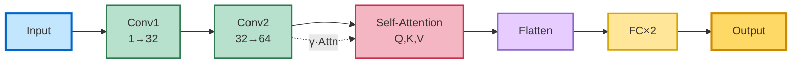

---

## 8. DPCCNN

**File:** `DPC_CNN.py`

### Architecture Design

Advanced CNN architecture featuring Dilated Pointwise Convolution with Squeeze-and-Excitation (SE) blocks and Global Attention Blocks (GAB) for enhanced feature extraction and recalibration.

### Architecture Components

#### DLICM Module (Dilated Linear Inverted Convolution Module)
- **Depthwise Dilated Conv**: Kernel=3, dilation=9, groups=in_channels
- **First Residual**: `z = x + depthwise(x)`
- **Pointwise Conv**: 1×1 convolution
- **SE Block**:
  - Global Average Pooling
  - FC1: channels→channels/reduction_ratio
  - ReLU
  - FC2: channels/reduction_ratio→channels
  - Sigmoid
- **Channel Recalibration**: `p_weighted = p * se_weight`
- **Second Residual**: `output = p_weighted + p`

#### GAB Module (Global Attention Block)
- **Conv**: channels→1, kernel=1
- **Softmax**: Over spatial dimension
- **Weighted Pooling**: `γ = sum(x * mask)`
- **Global Residual**: `output = x + γ`

#### Main Network Structure
1. **Conv1**: 1→16 channels, kernel=64
2. **BatchNorm + ReLU + MaxPool**: Kernel=4
3. **Conv2**: 16→64 channels, kernel=3
4. **BatchNorm + ReLU + MaxPool**: Kernel=4
5. **DLICM1** + **GAB1**: 64→64 channels
6. **DLICM2** + **GAB2**: 64→64 channels
7. **Global Average Pooling**
8. **Fully Connected**: 64→num_classes

### Hyperparameters

| Parameter | Value | Description |
|-----------|-------|-------------|
| `num_classes` | Configurable | Number of output classes |
| `conv1_out` | 16 | First conv output channels |
| `conv1_kernel` | 64 | First conv kernel size |
| `conv2_out` | 64 | Second conv output channels |
| `conv2_kernel` | 3 | Second conv kernel size |
| `dilation_rate` | 9 | Dilation rate in DLICM |
| `reduction_ratio` | 16 | SE block channel reduction |
| `pool_kernel` | 4 | MaxPool kernel size |

### Key Features
- **Multiple Residual Connections**: Within DLICM and GAB
- **Channel Attention**: Via SE blocks
- **Spatial Attention**: Via GAB
- **Dilated Convolutions**: For larger receptive field

### Input/Output
- **Input**: `(batch_size, 1, sequence_length)` - Single channel 1D signal (auto-unsqueezed from 2D)
- **Output**: `(batch_size, num_classes)` - Class logits

### Architecture Diagram

```mermaid
graph LR
    A[Input] --> B[Conv1<br/>1→16]
    B --> C[Conv2<br/>16→64]
    C --> D[DLICM+GAB<br/>SE Block]
    D --> E[DLICM+GAB<br/>SE Block]
    E --> F[GAP] --> G[FC] --> H[Output]
    C -.Residual.-> D
    D -.Residual.-> E
    style A fill:#c3e6ff,stroke:#0066cc,stroke-width:3px
    style B fill:#b7e1cd,stroke:#2d7a4f,stroke-width:2px
    style C fill:#b7e1cd,stroke:#2d7a4f,stroke-width:2px
    style D fill:#f4b6c2,stroke:#c9304f,stroke-width:2px
    style E fill:#f4b6c2,stroke:#c9304f,stroke-width:2px
    style F fill:#e6ccff,stroke:#8b66cc,stroke-width:2px
    style G fill:#ffe699,stroke:#d4a500,stroke-width:2px
    style H fill:#ffd966,stroke:#cc8800,stroke-width:3px
```

---

## 9. ResNetClassifier

**File:** `resnet.py`

### Architecture Design

Unique approach that converts 1D time-series signals to 2D spectrograms using Short-Time Fourier Transform (STFT), then applies a 2D ResNet with Bottleneck blocks.

### Architecture Components

#### Signal Preprocessing
- **STFT**: 
  - `n_fft=512`
  - `win_length=512`
  - `hop_length=512`
  - `center=False`
  - Returns complex spectrogram
- **Magnitude**: Takes absolute value of complex STFT
- **Resize**: Resizes to (64, 64) for ResNet compatibility
- **Channel Conversion**: 1→3 channels via Conv2d(kernel=3, padding='same')

#### ResNet Backend
- **Architecture**: Standard ResNet with Bottleneck blocks
- **Block Structure**: Bottleneck (1×1 → 3×3 → 1×1 convolutions)
- **Layers**: [1, 1, 1, 1] - One bottleneck per stage
- **Normalization**: BatchNorm2d
- **Final Layer**: Fully connected to num_classes

### Hyperparameters

| Parameter | Value | Description |
|-----------|-------|-------------|
| `num_classes` | 10 (default) | Number of output classes |
| `n_fft` | 512 | FFT size |
| `win_length` | 512 | Window length for STFT |
| `hop_length` | 512 | Hop size between windows |
| `resize_size` | (64, 64) | Spectrogram resize dimensions |
| `layers` | [1, 1, 1, 1] | Bottleneck blocks per stage |
| `input_channels` | 1 | Input signal channels |
| `resnet_channels` | 3 | ResNet input channels |

### Data Flow
1. **Input**: `(batch, 1, 2048)` - 1D signal
2. **After STFT**: `(batch, freq_bins, time_frames)` - Complex spectrogram
3. **After Abs**: `(batch, freq_bins, time_frames)` - Magnitude spectrogram
4. **After Resize**: `(batch, 64, 64)` - Resized spectrogram
5. **After Unsqueeze**: `(batch, 1, 64, 64)` - Add channel dim
6. **After Conv**: `(batch, 3, 64, 64)` - 3 channels for ResNet
7. **Output**: `(batch, num_classes)` - Class logits

### Input/Output
- **Input**: `(batch_size, 1, 2048)` - Single channel 1D signal
- **Output**: `(batch_size, num_classes)` - Class logits

### Architecture Diagram

```mermaid
graph LR
    A[Input<br/>1D Signal] --> B[STFT<br/>n_fft=512]
    B --> C[Magnitude<br/>Spectrogram]
    C --> D[Resize<br/>64×64]
    D --> E[Conv<br/>1→3ch]
    E --> F[ResNet<br/>Bottleneck×4]
    F --> G[GAP] --> H[FC] --> I[Output]
    style A fill:#c3e6ff,stroke:#0066cc,stroke-width:3px
    style B fill:#7fd8d8,stroke:#2d7a7a,stroke-width:2px
    style C fill:#7fd8d8,stroke:#2d7a7a,stroke-width:2px
    style D fill:#e6ccff,stroke:#8b66cc,stroke-width:2px
    style E fill:#b7e1cd,stroke:#2d7a4f,stroke-width:2px
    style F fill:#b7e1cd,stroke:#2d7a4f,stroke-width:2px
    style G fill:#e6ccff,stroke:#8b66cc,stroke-width:2px
    style H fill:#ffe699,stroke:#d4a500,stroke-width:2px
    style I fill:#ffd966,stroke:#cc8800,stroke-width:3px
```

---

## 10. TransformerEncoderClassifier

**File:** `transformer.py`

### Architecture Design

Pure transformer architecture for time-series classification. Converts raw signals to frequency domain using FFT, creates patches, and processes through multiple transformer encoder blocks.

### Architecture Components

#### Signal Preprocessing
- **FFT**: Converts time-domain to frequency-domain
- **Magnitude**: Takes absolute value of complex FFT
- **Layer Normalization**: Normalizes input

#### Embedding Layer (from `embedding.py`)
- **Patch Creation**: Divides signal into patches of size `patch_size`
- **Linear Embedding**: Each patch embedded to `embedding_dim`
- **Positional Encoding**: Optional sinusoidal positional encoding
- **Class Token**: Optional learnable classification token

#### TransformerEncoderBlock
- **Multi-Head Self-Attention**:
  - `num_heads` attention heads
  - `embed_dim` dimensions per head
  - `batch_first=True`
- **Residual Connection 1**: `x = x + attention(x)`
- **Layer Norm 1**
- **Feedforward Network**:
  - Linear: embedding_dim → feedforward_dim
  - LeakyReLU
  - Linear: feedforward_dim → embedding_dim
- **Residual Connection 2**: `x = x + feedforward(x)`
- **Layer Norm 2**

#### Classifier Head
- **Pooling**: 
  - If class token: Use first token `x[:, 0]`
  - Else: Mean pooling over sequence `x.mean(dim=1)`
- **MLP**:
  - Linear: embedding_dim → feedforward_dim
  - ReLU
  - Linear: feedforward_dim → num_classes

### Hyperparameters

| Parameter | Value | Description |
|-----------|-------|-------------|
| `input_dim` | 2048 | Input sequence length |
| `patch_size` | 32 | Size of each patch |
| `embedding_dim` | 64 | Embedding dimension |
| `positional_encoding` | True | Use positional encoding |
| `with_class_token` | True | Use learnable class token |
| `feedforward_dim` | 256 | FFN hidden dimension |
| `num_heads` | 8 | Number of attention heads |
| `num_encoders` | 12 | Number of encoder blocks |
| `number_of_channels` | 2 | Input signal channels |
| `num_classes` | 10 | Number of output classes |
| `dropout_rate` | 0.1 | Dropout probability |

### Sequence Length Calculation
- **Number of patches**: `input_dim / patch_size = 2048 / 32 = 64`
- **With class token**: 64 + 1 = 65 tokens
- **Embedding per channel**: `embedding_dim / number_of_channels`

### Computational Complexity
- **Attention Complexity**: O(L² × D) where L is sequence length, D is embedding dim
- **Per-layer Parameters**: ~4 × embedding_dim² (attention + FFN)
- **Total Parameters**: Depends on `num_encoders`

### Methods
- `forward(x)`: Full forward pass with preprocessing
- `encode(x)`: Forward pass without FFT preprocessing
- `freeze()`: Freeze all parameters
- `unfreeze()`: Unfreeze all parameters

### Input/Output
- **Input**: `(batch_size, number_of_channels, input_dim)` - Multi-channel signal
- **Output**: `(batch_size, num_classes)` - Class logits

### Architecture Diagram

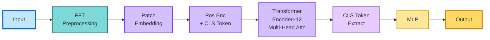

---

## 11. Supporting Modules

### 11.1 PositionalEncoder

**File:** `positional_encoder.py`

#### Purpose
Adds positional information to token embeddings in transformer architectures.

#### Implementation
- **Sinusoidal Encoding**:
  - Even indices: `PE(pos, 2i) = sin(pos / 10000^(2i/d))`
  - Odd indices: `PE(pos, 2i+1) = cos(pos / 10000^(2i/d))`
- **Precomputed**: Encoding matrix computed during initialization
- **Registered Buffer**: Automatically moves with model device

#### Parameters
| Parameter | Default | Description |
|-----------|---------|-------------|
| `embedding_dim` | Required | Dimension of embeddings |
| `seq_len` | Required | Maximum sequence length |
| `n` | 10000 | Base for positional scaling |

---

### 11.2 EmbeddingLinear

**File:** `embedding.py`

#### Purpose
Converts raw time-series signals into patch-based embeddings for transformer processing.

#### Components

**Patch Creation**:
- Uses `unfold` operation to create non-overlapping patches
- Output shape: `(batch, num_patches, channels, patch_size)`

**Linear Projection**:
- Each patch linearly projected to embedding space
- Separate embedding per channel, then concatenated

**ClassToken**:
- Learnable token prepended to sequence
- Initialized with truncated normal (std=0.02)

#### Process Flow
1. Create patches from input signal
2. Flatten batch and patch dimensions
3. Apply linear embedding per channel
4. Reshape back to `(batch, num_patches, embedding_dim)`
5. Add positional encoding (if enabled)
6. Prepend class token (if enabled)

#### Parameters
| Parameter | Default | Description |
|-----------|---------|-------------|
| `input_dim` | Required | Input sequence length |
| `patch_size` | 32 | Size of each patch |
| `positional_encoding` | False | Enable positional encoding |
| `with_class_token` | False | Prepend class token |
| `number_of_channels` | 2 | Number of input channels |
| `embedding_dim` | 32 | Output embedding dimension |

---

## Model Comparison Diagram

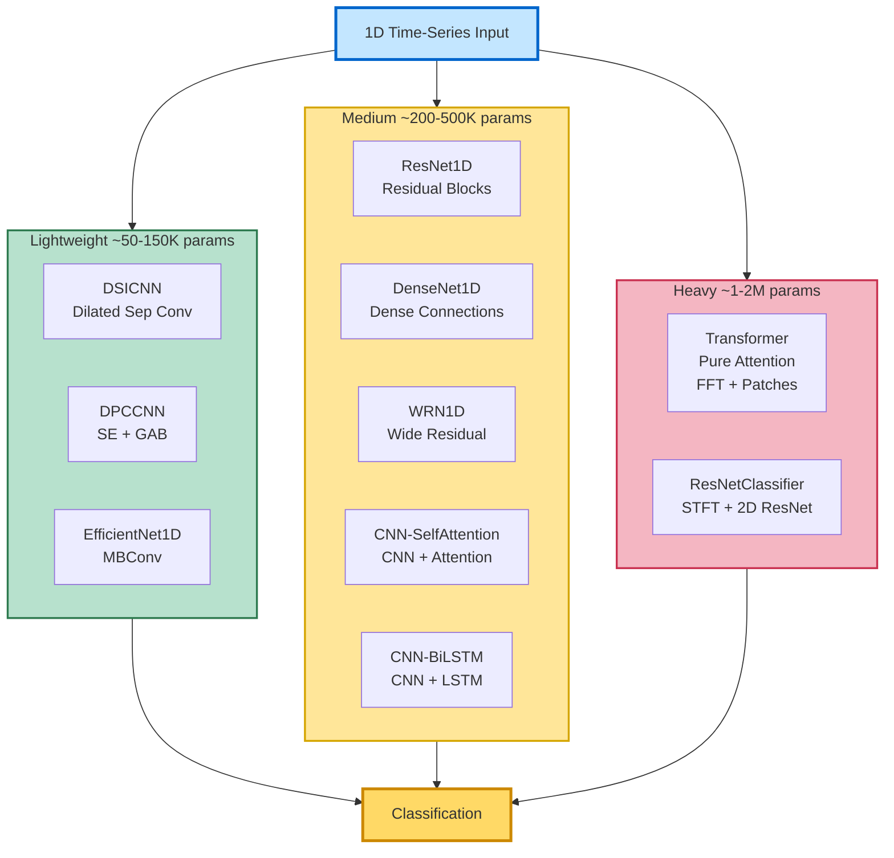

---

## Summary Table

| Model | Type | Key Features | Parameters (approx) | Best For |
|-------|------|--------------|---------------------|----------|
| DSICNN | CNN | Dilated depthwise separable convolutions | ~50K | Lightweight, efficient |
| ResNet1D | CNN | Residual connections, deep architecture | ~200K | General purpose |
| DenseNet1D | CNN | Dense connections, feature reuse | ~300K | Feature-rich tasks |
| EfficientNet1D | CNN | Mobile inverted bottlenecks | ~150K | Efficient, mobile-friendly |
| WRN1D | CNN | Wide residual blocks | ~400K | High capacity needs |
| CNN_BiLSTM | Hybrid | CNN + bidirectional LSTM | ~500K | Temporal dependencies |
| CNN_SelfAttention | Hybrid | CNN + self-attention | ~300K | Long-range dependencies |
| DPCCNN | Advanced CNN | SE blocks, GAB, dilated convolutions | ~100K | Complex pattern recognition |
| ResNetClassifier | 2D CNN | STFT + 2D ResNet | ~2M | Frequency domain analysis |
| TransformerEncoderClassifier | Transformer | Pure attention, patch-based | ~1M | Sequence modeling |

---

## Usage Examples

### Basic Usage

```python
from models import TransformerEncoderClassifier, ResNet1D, CNN_BiLSTM

# Transformer
model = TransformerEncoderClassifier(
    input_dim=2048,
    patch_size=32,
    embedding_dim=64,
    num_encoders=12,
    num_classes=10
)

# ResNet1D
model = ResNet1D(
    block=ResidualBlock,
    layers=[2, 2, 2],  # Number of blocks per layer
    num_classes=10
)

# CNN_BiLSTM
model = CNN_BiLSTM(
    input_channels=1,
    num_classes=10,
    hidden_size=128,
    lstm_layers=2
)
```

### Training Considerations

1. **Input Shape Requirements**:
   - Most models: `(batch, 1, sequence_length)`
   - Transformer: `(batch, channels, sequence_length)`
   - ResNetClassifier: `(batch, 1, 2048)` fixed

2. **Memory Usage**:
   - Transformer: High due to O(L²) attention
   - CNN models: Moderate
   - Hybrid models: Varies with sequence length

3. **Recommended Batch Sizes**:
   - Transformer: 16-32
   - CNN models: 32-128
   - Hybrid models: 32-64

---

## Design Patterns

### Common Patterns Across Models

1. **Batch Normalization**: Used after most convolutional layers
2. **ReLU Activation**: Primary non-linearity (except Transformer uses LeakyReLU)
3. **Global Average Pooling**: Reduces spatial dimensions before classification
4. **Skip Connections**: Present in ResNet, WRN, DenseNet, DPCCNN
5. **Dropout**: Used for regularization (varying rates)

### Architectural Innovations

1. **DSICNN/DPCCNN**: Depthwise separable + dilation for efficiency
2. **DPCCNN**: Combines SE blocks (channel attention) + GAB (spatial attention)
3. **ResNetClassifier**: Time→Frequency domain transformation
4. **TransformerEncoderClassifier**: FFT preprocessing + patch embedding
5. **CNN_SelfAttention**: Hybrid local (CNN) + global (attention) features

---

## References

- ResNet: He et al., "Deep Residual Learning for Image Recognition" (2015)
- DenseNet: Huang et al., "Densely Connected Convolutional Networks" (2017)
- EfficientNet: Tan & Le, "EfficientNet: Rethinking Model Scaling" (2019)
- Wide ResNet: Zagoruyko & Komodakis, "Wide Residual Networks" (2016)
- Transformer: Vaswani et al., "Attention Is All You Need" (2017)
- Squeeze-and-Excitation: Hu et al., "Squeeze-and-Excitation Networks" (2018)

---

*Last Updated: December 12, 2025*

